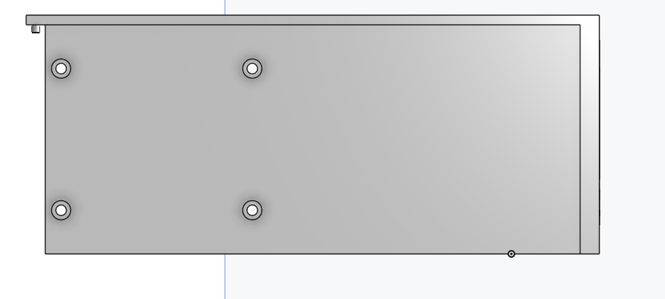
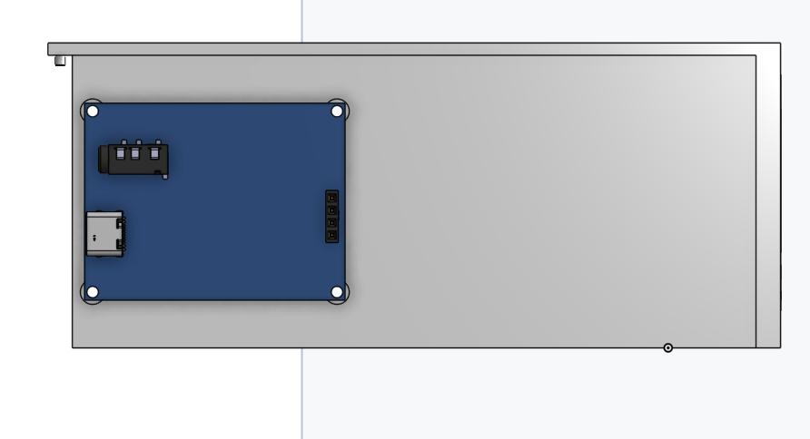
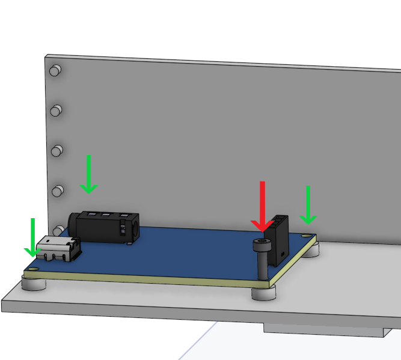
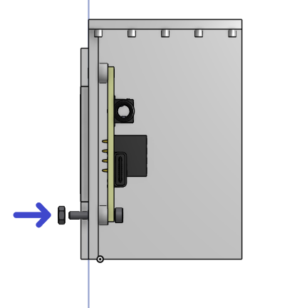
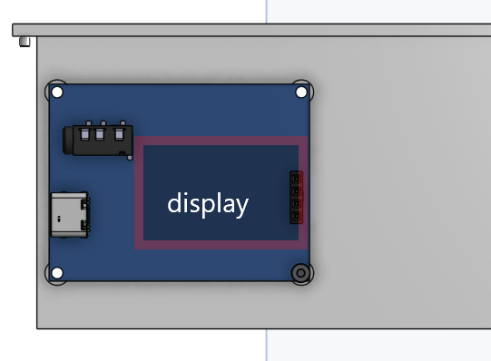

# talking-train

## File structure
- Please ignore /hardware/old-design, for reference only
- Manufacturing files in hardware/manufacturing-outputs/...
- Code in /software - these scripts are in MicroPython and target the ESP32 microcontroller, expecting a 128x64 SSD1306 I2C OLED display and an [I2S audio output device](https://github.com/miketeachman/micropython-i2s-examples)
## Part examples
- SSD1306 128x64 display: https://www.aliexpress.com/item/1005007551771400.html
- Check Bill of Materials file for all other parts, these have LSCS part numbers for ease of ordering
- 4x M2 screws with nuts, 1cm length

## Features
- Loads stations and displays them in order on the OLED screen
- Audio playback with hi-res audio
- Line creation tool
- Audio playback support

## Key files
- hardware/manufacturing-outputs/ contains the files (.stl, pick and place, gerber, BOM) needed to produce the finished product, with the 3D files for the case in manufacturing-outputs/3d/ and the PCB in manufacturing-outputs/pcb/ 
- Source files like the EasyEDA (.epro) file and the 3D model of the PCB (only really necessary for designing a new case) is in hardware/source-files
- Use [the onshape file](https://cad.onshape.com/documents/c1f604bc7dcb19d0034320b9/w/e582f7a5ec8be5c9c5e2ed68/e/27ea5781da26a9e15f82bfe8?renderMode=0&uiState=69ecb3f7b8b8dff4899cd660) onshape for the case 3D source, and access an interactive bom on [my website](https://felix.ink/ttrain1)
- software/ contains the line creation tool and the software for the ESP32 to run.

## Assembly
- Assemble the PCB outside of the case by soldering on the parts. Do not attach the display at this stage. 
- To protect from the unlikely event of soldering error, do not plug the usb-c port directly into an important device: plug into a wall outlet first and check if the power LED is active. If not, I recommend stopping using the device.
- Place this 3D printed piece flat on an assembly bench.

- Place the PCB onto the round pieces that poke out, which are used to seperate it from the case. Make sure it is in this alignment and that the screwholes line up.

- Then, insert the screws into the screwholes as shown in the graphic, taking care not to poke the board components.

- Rotate the model so that it sits with the side of the train on the desk and the top of the train facing upwards. Turn the nut around the screw to secure the PCB.

- Next, return the PCB to the original orientation, with the side of the model the PCB is attached to, resting on the desk. Gently attach the display in this orientation, ensuring the pins line up with the header.

- Finally, take the other part of the 3D model, place it down with its base on the desk. Align the attachment pins from the top side (which we have just assembled) with the sockets from the part we put down, and push it in.

This should now be ready for use. Attach by USB-C to your computer, [set up MicroPython](https://docs.sunfounder.com/projects/esp32-starter-kit/en/latest/micropython/python_start/install_micropython.html), flash the software, and attach a pair of wired headphones to the device. 

Note: please be careful with audio - I don't know how loud it'll be until I test the model.

### For reference, other parts rendered:

The pieces used for mounting the top half of the model:

Fit into these holes on the bottom part of the model.

## Graphics

## Reference materials
- https://macsbug.wordpress.com/2021/02/19/web-radio-of-m5stack-pcm5102a-i2s-dac/ for DAC schematic
- https://documentation.espressif.com/esp32-c3_datasheet_en.pdf for ESP32-C3 datasheet
- https://www.ti.com/lit/ds/symlink/tpa6132a2.pdf, especially Figure 24, for amplifier datasheet and schematic