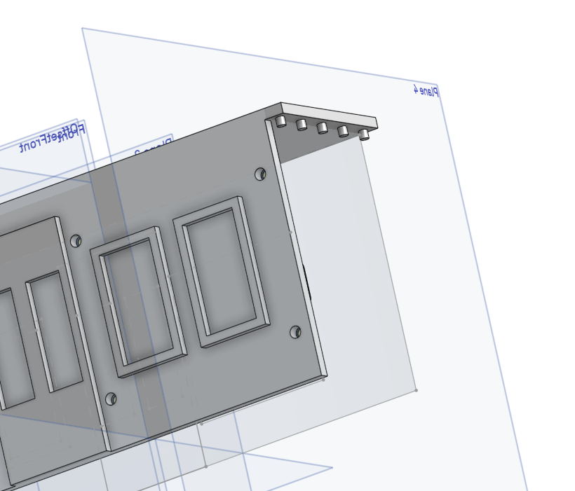
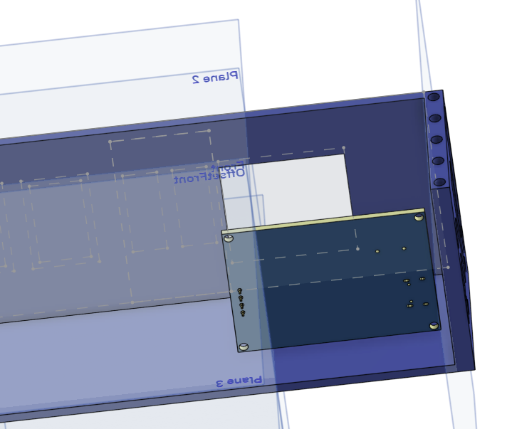

# talking-train

## File structure
- Please ignore /hardware/old-design, for reference only
- Manufacturing files in hardware/manufacturing-outputs/...
- Code in /software - these scripts are in MicroPython and target the ESP32 microcontroller, expecting a 128x64 SSD1306 I2C OLED display and an [I2S audio output device](https://github.com/miketeachman/micropython-i2s-examples)
## Part examples
- SSD1306 128x64 display: https://www.aliexpress.com/item/1005007551771400.html
- Check Bill of Materials file for all other parts, these have LSCS part numbers for ease of ordering
- 4x M3 screws with nuts, 1cm length or so (exact detail in progress)

## Features
- Loads stations and displays them in order on the OLED screen
- Audio playback with hi-res audio
- Line creation tool
- Audio playback support

## Key files
- hardware/working-model.stl is the final 3D model - you can upload this straight to JLC3DP and print out
- hardware/BOM.xlsx is the bill of materials, upload this to LSCS.com to order all.
- hardware/Gerber_V1 is the Gerber file for PCB production
- software/ contains the line creation tool and the software for the ESP32 to run.
- https://cad.onshape.com/documents/c1f604bc7dcb19d0034320b9/w/e582f7a5ec8be5c9c5e2ed68/e/27ea5781da26a9e15f82bfe8?renderMode=0&uiState=69e37fad07cea94ea421e9c8 for the 3D printing source

## Assembly
- The parts of the model clip together. Once you have all parts and everything soldered onto the board, screw the 

The pieces used for mounting the top half of the model:

Fit into these holes on the bottom part of the model.

## Graphics

## Reference materials
- https://macsbug.wordpress.com/2021/02/19/web-radio-of-m5stack-pcm5102a-i2s-dac/ for DAC schematic
- https://documentation.espressif.com/esp32-c3_datasheet_en.pdf for ESP32-C3 datasheet
- https://www.ti.com/lit/ds/symlink/tpa6132a2.pdf, especially Figure 24, for amplifier datasheet and schematic